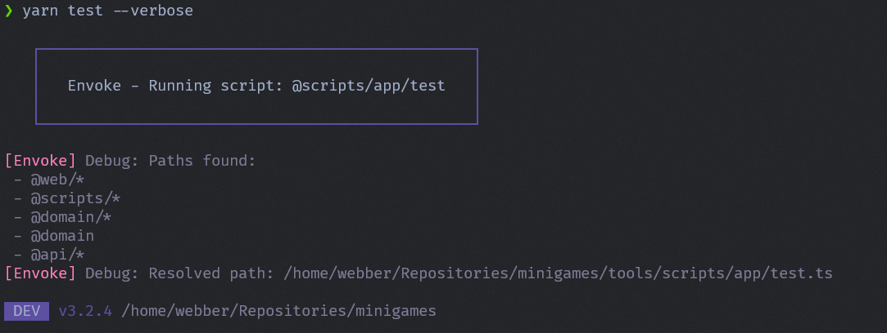

# Envoke

A simple script runner.

---

Smooths out script running. Hear me out:

### Simplify paths 

By allowing tsconfig path mappings when calling scripts

```jsonc
// tsconfig.json
{
  "compilerOptions": {
    "baseUrl": ".",
    "paths": {
      "@scripts/*": ["tools/scripts/*"]
    }
  }
}
```

```diff
// package.json
{
  "scripts": {
-   "test": "tsx ./tools/scripts/app/test.ts",
+   "test": "envoke @scripts/app/test",
  }
}
```

Then run it (use --verbose while debugging)



### Support monorepos

Will keep track of the execution context as well as the root of the repository.

The following "just works".

```diff
- "build": "run -T tsx ../../tools/scripts/app/test.ts",
+ "build": "run -T envoke @scripts/app/test",
```

### Preserves env vars

Environment variables are automatically passed through to the child process.

```diff
- "build": "ENV=production tsx ./tools/scripts/app/build-web.ts",
+ "build": "ENV=production envoke @scripts/app/build-web",
```

### Supports CI

Works great in CI environments, where you might use `actions/github-script` or scall scripts directly.

```diff
      - name: Update PR comment with deployment info
-       run: yarn run -T tsx tools/scripts/ci/update-pr-comment.ts
+       run: yarn run -T envoke @scripts/ci/update-pr-comment
        env:
          CI: true
          GITHUB_TOKEN: ${{ secrets.GITHUB_TOKEN }}
          GITHUB_REPOSITORY: ${{ github.repository }}
          GITHUB_PR_NUMBER: ${{ github.event.pull_request.number }}
```

## Setup

Install it

```bash
npm install --save-dev @takken/envoke
# or
yarn add -D @takken/envoke
# or
pnpm add -D @takken/envoke
# or 
bun add -d @takken/envoke
```

Create a test script:

```ts
// ./scripts/hello.ts
console.log("Hello, world!");
console.log("Args:", process.argv.slice(2));
console.log("Env:", process.env);
```

Add a path mapping in your tsconfig.json:

```json
{
  "compilerOptions": {
    "baseUrl": ".",
    "paths": {
      "@scripts/*": ["./scripts/*"]
    }
  }
}
```

Then try it

```bash
npx envoke @scripts/hello --verbose
# or
yarn envoke @scripts/hello --verbose
# or
pnpm envoke @scripts/hello --verbose
# or
bun run envoke @scripts/hello --verbose
```

## Todo

- Read .env files using [dotenv](https://www.npmjs.com/package/dotenv)
- Add flag to pass NODE_ENV=production/development

## License

This package is [MIT](./LICENSE) licensed.
